# PostgreSQL Relational Database Design

## Conventions

Schemas mirror bounded contexts: identity, catalog, inventory, customer, cart, wishlist, checkout, ordering, payment, shipment, review, promotion, notification, and audit. Every table uses UUID primary keys generated by the application, except documented composite keys. All timestamps are timestamp with time zone. Every amount is numeric(19,4) and every currency is char(3). JSON snapshots use jsonb. FK marked Logical is intentionally not enforced across bounded-context schemas; all other FKs are physical.

All mutable roots include created_at timestamptz not null, updated_at timestamptz not null, and version bigint not null default 0. Status/type fields are varchar(40) with CHECK constraints enumerated in migrations. Text values that participate in case-insensitive uniqueness use citext.

## Table specifications

### identity

#### identity.user_account
- Columns: id uuid PK; email citext not null; email_verified_at timestamptz null; password_hash varchar(255) null; status varchar(40) not null; failed_login_count integer not null default 0; locked_until timestamptz null; last_login_at timestamptz null; created_at timestamptz; updated_at timestamptz; version bigint.
- PK: id. FK: none.
- Unique: uq_user_account_email(email).
- Indexes: ix_user_account_status_created_at(status, created_at). Checks: failed_login_count >= 0; password_hash required for local-password account.

#### identity.role
- Columns: id uuid PK; code varchar(64) not null; name varchar(120) not null; description text null; created_at timestamptz; updated_at timestamptz.
- PK: id. FK: none. Unique: uq_role_code(code). Indexes: uq_role_code.

#### identity.user_role
- Columns: user_account_id uuid not null; role_id uuid not null; granted_at timestamptz not null; granted_by_user_account_id uuid null.
- PK: (user_account_id, role_id). FK: user_account_id -> identity.user_account(id); role_id -> identity.role(id); granted_by_user_account_id -> identity.user_account(id).
- Unique: composite PK. Indexes: ix_user_role_role_account(role_id, user_account_id).

#### identity.refresh_session
- Columns: id uuid PK; user_account_id uuid not null; token_hash char(64) not null; device_label varchar(160) null; ip_address inet null; user_agent text null; expires_at timestamptz not null; revoked_at timestamptz null; created_at timestamptz.
- PK: id. FK: user_account_id -> identity.user_account(id).
- Unique: uq_refresh_session_token_hash(token_hash). Indexes: ix_refresh_session_account_expiry(user_account_id, expires_at); ix_refresh_session_active(expires_at) where revoked_at is null.

#### identity.external_identity
- Columns: id uuid PK; user_account_id uuid not null; provider varchar(64) not null; provider_subject varchar(255) not null; email_at_provider citext null; created_at timestamptz.
- PK: id. FK: user_account_id -> identity.user_account(id).
- Unique: uq_external_identity_provider_subject(provider, provider_subject). Indexes: ix_external_identity_account(user_account_id).

### catalog

#### catalog.product
- Columns: id uuid PK; slug citext not null; product_type varchar(64) not null; brand varchar(120) null; title varchar(300) not null; description text null; status varchar(40) not null; tax_category varchar(64) not null; assembled_length numeric(12,3) null; assembled_width numeric(12,3) null; assembled_height numeric(12,3) null; dimension_unit varchar(8) null; seo_title varchar(300) null; seo_description varchar(500) null; published_at timestamptz null; created_at; updated_at; version.
- PK: id. FK: none. Unique: uq_product_slug(slug).
- Indexes: ix_product_status_published(status, published_at); ix_product_brand_status(brand, status); gin_product_search(to_tsvector(title || description)). Checks: dimensions positive when supplied.

#### catalog.product_variant
- Columns: id uuid PK; product_id uuid not null; sku varchar(80) not null; barcode varchar(80) null; title_suffix varchar(180) null; status varchar(40) not null; weight numeric(12,3) null; weight_unit varchar(8) null; package_length numeric(12,3) null; package_width numeric(12,3) null; package_height numeric(12,3) null; dimension_unit varchar(8) null; requires_assembly boolean not null default false; lead_time_days smallint not null default 0; created_at; updated_at; version.
- PK: id. FK: product_id -> catalog.product(id).
- Unique: uq_variant_sku(sku); uq_variant_barcode(barcode) where barcode is not null.
- Indexes: ix_variant_product_status(product_id, status). Checks: lead_time_days >= 0; weight/dimensions positive when supplied.

#### catalog.category
- Columns: id uuid PK; parent_id uuid null; slug citext not null; name varchar(180) not null; description text null; sort_order integer not null default 0; status varchar(40) not null; created_at; updated_at; version.
- PK: id. FK: parent_id -> catalog.category(id).
- Unique: uq_category_slug(slug). Indexes: ix_category_parent_sort(parent_id, sort_order); ix_category_status_sort(status, sort_order). Checks: parent_id <> id.

#### catalog.product_category
- Columns: product_id uuid not null; category_id uuid not null; is_primary boolean not null default false; sort_order integer not null default 0.
- PK: (product_id, category_id). FK: product_id -> catalog.product(id); category_id -> catalog.category(id).
- Unique: uq_product_category_primary(product_id) where is_primary. Indexes: ix_product_category_category_sort(category_id, sort_order, product_id).

#### catalog.product_media
- Columns: id uuid PK; product_id uuid not null; variant_id uuid null; media_type varchar(32) not null; url text not null; alt_text varchar(300) null; sort_order integer not null default 0; status varchar(40) not null; created_at timestamptz.
- PK: id. FK: product_id -> catalog.product(id); variant_id -> catalog.product_variant(id).
- Unique: uq_product_media_url(product_id, url). Indexes: ix_product_media_scope_sort(product_id, variant_id, sort_order).

#### catalog.attribute_definition
- Columns: id uuid PK; code varchar(64) not null; name varchar(120) not null; data_type varchar(24) not null; is_variant_defining boolean not null default true; sort_order integer not null default 0; status varchar(40) not null; created_at; updated_at.
- PK: id. FK: none. Unique: uq_attribute_definition_code(code). Indexes: uq_attribute_definition_code.

#### catalog.variant_attribute_value
- Columns: variant_id uuid not null; attribute_definition_id uuid not null; value_text varchar(500) null; value_number numeric(19,4) null; value_boolean boolean null; value_code varchar(100) null.
- PK: (variant_id, attribute_definition_id). FK: variant_id -> catalog.product_variant(id); attribute_definition_id -> catalog.attribute_definition(id).
- Unique: composite PK. Indexes: ix_variant_attribute_facet(attribute_definition_id, value_code, variant_id). Checks: exactly one value column is non-null.

#### catalog.price
- Columns: id uuid PK; variant_id uuid not null; market varchar(16) not null; channel varchar(32) not null; currency char(3) not null; list_amount numeric(19,4) not null; sale_amount numeric(19,4) not null; valid_from timestamptz not null; valid_until timestamptz null; status varchar(40) not null; created_at; updated_at; version.
- PK: id. FK: variant_id -> catalog.product_variant(id).
- Unique: none. Indexes: ix_price_lookup(variant_id, market, channel, currency, status, valid_from, valid_until). Checks: list_amount >= 0; sale_amount between 0 and list_amount; valid_until > valid_from. Exclusion constraint: active effective ranges do not overlap for variant/market/channel/currency.

### inventory

#### inventory.warehouse
- Columns: id uuid PK; code varchar(40) not null; name varchar(180) not null; address_snapshot jsonb not null; status varchar(40) not null; fulfilment_priority integer not null default 0; created_at; updated_at; version.
- PK: id. FK: none. Unique: uq_warehouse_code(code). Indexes: ix_warehouse_status_priority(status, fulfilment_priority).

#### inventory.stock_item
- Columns: id uuid PK; warehouse_id uuid not null; variant_id uuid not null Logical FK catalog.product_variant; on_hand_quantity integer not null default 0; reserved_quantity integer not null default 0; safety_stock_quantity integer not null default 0; reorder_point integer null; created_at; updated_at; version.
- PK: id. FK: warehouse_id -> inventory.warehouse(id); variant_id logical.
- Unique: uq_stock_item_warehouse_variant(warehouse_id, variant_id). Indexes: ix_stock_item_variant_warehouse(variant_id, warehouse_id). Checks: all quantities >= 0; reserved_quantity <= on_hand_quantity.

#### inventory.stock_reservation
- Columns: id uuid PK; stock_item_id uuid not null; reference_type varchar(40) not null; reference_id uuid not null; quantity integer not null; status varchar(40) not null; expires_at timestamptz not null; confirmed_at timestamptz null; released_at timestamptz null; created_at timestamptz.
- PK: id. FK: stock_item_id -> inventory.stock_item(id); reference_id logical CheckoutSession or Order.
- Unique: uq_stock_reservation_reference(stock_item_id, reference_type, reference_id). Indexes: ix_stock_reservation_expiry(status, expires_at). Checks: quantity > 0.

#### inventory.inventory_movement
- Columns: id uuid PK; stock_item_id uuid not null; movement_type varchar(40) not null; quantity_delta integer not null; reference_type varchar(40) null; reference_id uuid null; occurred_at timestamptz not null; performed_by uuid null; reason varchar(500) null.
- PK: id. FK: stock_item_id -> inventory.stock_item(id); reference_id logical.
- Unique: none. Indexes: ix_inventory_movement_stock_time(stock_item_id, occurred_at); ix_inventory_movement_reference(reference_type, reference_id). Checks: quantity_delta <> 0.

### customer

#### customer.customer_profile
- Columns: id uuid PK; user_account_id uuid null Logical FK identity.user_account; first_name varchar(120) not null; last_name varchar(120) not null; phone varchar(32) null; date_of_birth date null; locale varchar(35) not null; status varchar(40) not null; marketing_consent_at timestamptz null; consent_source varchar(80) null; consent_text_version varchar(40) null; created_at; updated_at; version.
- PK: id. FK: user_account_id logical.
- Unique: uq_customer_user_account(user_account_id) where user_account_id is not null. Indexes: ix_customer_status_created(status, created_at).

#### customer.address
- Columns: id uuid PK; customer_id uuid not null; label varchar(100) null; recipient_name varchar(240) not null; line1 varchar(255) not null; line2 varchar(255) null; district varchar(120) null; city varchar(120) not null; region varchar(120) null; postal_code varchar(32) null; country_code char(2) not null; phone varchar(32) null; is_default_shipping boolean not null default false; is_default_billing boolean not null default false; status varchar(40) not null; created_at; updated_at; version.
- PK: id. FK: customer_id -> customer.customer_profile(id).
- Unique: uq_address_default_shipping(customer_id) where is_default_shipping and status = 'ACTIVE'; uq_address_default_billing(customer_id) where is_default_billing and status = 'ACTIVE'. Indexes: ix_address_customer_status_updated(customer_id, status, updated_at).

### cart and wishlist

#### cart.cart
- Columns: id uuid PK; customer_id uuid null Logical FK customer.customer_profile; guest_token_hash char(64) null; market varchar(16) not null; currency char(3) not null; status varchar(40) not null; expires_at timestamptz null; coupon_code citext null; created_at; updated_at; version.
- PK: id. FK: customer_id logical.
- Unique: uq_cart_guest_token(guest_token_hash) where guest_token_hash is not null; uq_cart_active_customer(customer_id, market, currency) where status = 'ACTIVE'. Indexes: ix_cart_status_expiry(status, expires_at). Checks: exactly one of customer_id and guest_token_hash is non-null.

#### cart.cart_item
- Columns: id uuid PK; cart_id uuid not null; variant_id uuid not null Logical FK catalog.product_variant; quantity integer not null; selected_options_snapshot jsonb null; added_at timestamptz not null; updated_at timestamptz not null.
- PK: id. FK: cart_id -> cart.cart(id); variant_id logical.
- Unique: uq_cart_item_variant(cart_id, variant_id). Indexes: ix_cart_item_cart_added(cart_id, added_at). Checks: quantity > 0.

#### wishlist.wishlist
- Columns: id uuid PK; customer_id uuid not null Logical FK customer.customer_profile; name varchar(120) not null; normalized_name citext not null; is_default boolean not null default false; visibility varchar(24) not null; created_at; updated_at; version.
- PK: id. FK: customer_id logical.
- Unique: uq_wishlist_customer_name(customer_id, normalized_name); uq_wishlist_default(customer_id) where is_default. Indexes: ix_wishlist_customer_default(customer_id, is_default).

#### wishlist.wishlist_item
- Columns: id uuid PK; wishlist_id uuid not null; product_id uuid not null Logical FK catalog.product; variant_id uuid null Logical FK catalog.product_variant; note varchar(1000) null; added_at timestamptz not null.
- PK: id. FK: wishlist_id -> wishlist.wishlist(id); product_id and variant_id logical.
- Unique: uq_wishlist_item_selection(wishlist_id, product_id, variant_id) nulls not distinct. Indexes: ix_wishlist_item_wishlist_added(wishlist_id, added_at).

### checkout and ordering

#### checkout.checkout_session
- Columns: id uuid PK; cart_id uuid not null Logical FK cart.cart; customer_id uuid null Logical FK customer.customer_profile; idempotency_key varchar(128) not null; status varchar(40) not null; currency char(3) not null; line_snapshot jsonb not null; shipping_address_snapshot jsonb null; billing_address_snapshot jsonb null; shipping_option_snapshot jsonb null; totals_snapshot jsonb not null; coupon_snapshot jsonb null; expires_at timestamptz not null; order_id uuid null Logical FK ordering.order; created_at; updated_at; version.
- PK: id. FK: all listed references are logical.
- Unique: uq_checkout_idempotency(idempotency_key); uq_checkout_active_cart(cart_id) where status in ('OPEN','PAYMENT_PENDING'). Indexes: ix_checkout_status_expiry(status, expires_at); uq_checkout_order(order_id) where order_id is not null.

#### ordering.order
- Columns: id uuid PK; order_number varchar(32) not null; customer_id uuid null Logical FK customer.customer_profile; checkout_session_id uuid null Logical FK checkout.checkout_session; email_snapshot citext not null; status varchar(40) not null; payment_status varchar(40) not null; fulfilment_status varchar(40) not null; currency char(3) not null; subtotal_amount numeric(19,4) not null; discount_amount numeric(19,4) not null; shipping_amount numeric(19,4) not null; tax_amount numeric(19,4) not null; grand_total_amount numeric(19,4) not null; placed_at timestamptz not null; cancelled_at timestamptz null; cancellation_reason varchar(500) null; created_at; updated_at; version.
- PK: id. FK: customer_id and checkout_session_id logical.
- Unique: uq_order_number(order_number); uq_order_checkout(checkout_session_id) where checkout_session_id is not null. Indexes: ix_order_customer_placed(customer_id, placed_at desc); ix_order_status_placed(status, placed_at); ix_order_payment_placed(payment_status, placed_at). Checks: grand_total_amount = subtotal_amount - discount_amount + shipping_amount + tax_amount.

#### ordering.order_item
- Columns: id uuid PK; order_id uuid not null; variant_id uuid not null Logical FK catalog.product_variant; sku_snapshot varchar(80) not null; product_title_snapshot varchar(300) not null; variant_title_snapshot varchar(180) null; quantity_ordered integer not null; quantity_cancelled integer not null default 0; quantity_shipped integer not null default 0; unit_list_price numeric(19,4) not null; unit_sale_price numeric(19,4) not null; discount_amount numeric(19,4) not null default 0; tax_amount numeric(19,4) not null default 0; line_total numeric(19,4) not null; tax_category_snapshot varchar(64) not null; weight_snapshot numeric(12,3) null; created_at timestamptz not null.
- PK: id. FK: order_id -> ordering.order(id); variant_id logical.
- Unique: none. Indexes: ix_order_item_order(order_id); ix_order_item_variant_created(variant_id, created_at). Checks: quantities >= 0; quantity_cancelled + quantity_shipped <= quantity_ordered.

#### ordering.order_address
- Columns: id uuid PK; order_id uuid not null; address_type varchar(16) not null; recipient_name varchar(240) not null; line1 varchar(255) not null; line2 varchar(255) null; district varchar(120) null; city varchar(120) not null; region varchar(120) null; postal_code varchar(32) null; country_code char(2) not null; phone varchar(32) null; created_at timestamptz not null.
- PK: id. FK: order_id -> ordering.order(id).
- Unique: uq_order_address_type(order_id, address_type). Indexes: ix_order_address_order(order_id).

#### ordering.order_status_history
- Columns: id uuid PK; order_id uuid not null; from_status varchar(40) null; to_status varchar(40) not null; reason varchar(500) null; actor_type varchar(40) not null; actor_id uuid null; occurred_at timestamptz not null.
- PK: id. FK: order_id -> ordering.order(id).
- Unique: none. Indexes: ix_order_status_history_order_time(order_id, occurred_at).

### payment

#### payment.payment
- Columns: id uuid PK; order_id uuid not null Logical FK ordering.order; provider varchar(64) not null; method_type varchar(40) not null; amount_authorized numeric(19,4) not null default 0; amount_captured numeric(19,4) not null default 0; amount_refunded numeric(19,4) not null default 0; currency char(3) not null; status varchar(40) not null; provider_customer_reference varchar(255) null; created_at; updated_at; version.
- PK: id. FK: order_id logical.
- Unique: none. Indexes: ix_payment_order_status(order_id, status); ix_payment_provider_status_time(provider, status, created_at). Checks: amounts >= 0; captured <= authorized; refunded <= captured.

#### payment.payment_attempt
- Columns: id uuid PK; payment_id uuid not null; operation varchar(40) not null; idempotency_key varchar(128) not null; provider_transaction_id varchar(255) null; status varchar(40) not null; requested_amount numeric(19,4) not null; response_code varchar(80) null; failure_code varchar(80) null; failure_message varchar(500) null; initiated_at timestamptz not null; completed_at timestamptz null.
- PK: id. FK: payment_id -> payment.payment(id).
- Unique: uq_payment_attempt_provider_tx(provider_transaction_id) where provider_transaction_id is not null; uq_payment_attempt_idempotency(payment_id, operation, idempotency_key). Indexes: ix_payment_attempt_payment_time(payment_id, initiated_at).

#### payment.refund
- Columns: id uuid PK; payment_id uuid not null; order_id uuid not null Logical FK ordering.order; amount numeric(19,4) not null; currency char(3) not null; reason varchar(500) not null; status varchar(40) not null; provider_refund_id varchar(255) null; requested_at timestamptz not null; completed_at timestamptz null.
- PK: id. FK: payment_id -> payment.payment(id); order_id logical.
- Unique: uq_refund_provider_id(provider_refund_id) where provider_refund_id is not null. Indexes: ix_refund_payment_status(payment_id, status). Checks: amount > 0.

### shipment

#### shipment.shipment
- Columns: id uuid PK; order_id uuid not null Logical FK ordering.order; warehouse_id uuid not null Logical FK inventory.warehouse; shipment_number varchar(40) not null; carrier_code varchar(64) null; service_level varchar(64) null; tracking_number varchar(160) null; status varchar(40) not null; shipping_address_snapshot jsonb not null; estimated_delivery_from date null; estimated_delivery_until date null; shipped_at timestamptz null; delivered_at timestamptz null; created_at; updated_at; version.
- PK: id. FK: order_id and warehouse_id logical.
- Unique: uq_shipment_number(shipment_number); uq_shipment_carrier_tracking(carrier_code, tracking_number) where tracking_number is not null. Indexes: ix_shipment_order_status(order_id, status); ix_shipment_warehouse_status(warehouse_id, status).

#### shipment.shipment_item
- Columns: id uuid PK; shipment_id uuid not null; order_item_id uuid not null Logical FK ordering.order_item; quantity integer not null.
- PK: id. FK: shipment_id -> shipment.shipment(id); order_item_id logical.
- Unique: uq_shipment_item_line(shipment_id, order_item_id). Indexes: ix_shipment_item_order_item(order_item_id). Checks: quantity > 0.

#### shipment.tracking_event
- Columns: id uuid PK; shipment_id uuid not null; carrier_event_code varchar(80) null; status varchar(40) not null; description varchar(1000) null; location varchar(300) null; occurred_at timestamptz not null; received_at timestamptz not null; raw_event_hash char(64) not null.
- PK: id. FK: shipment_id -> shipment.shipment(id).
- Unique: uq_tracking_event_dedup(shipment_id, carrier_event_code, occurred_at, raw_event_hash). Indexes: ix_tracking_event_shipment_time(shipment_id, occurred_at).

### review

#### review.review
- Columns: id uuid PK; customer_id uuid not null Logical FK customer.customer_profile; product_id uuid not null Logical FK catalog.product; order_item_id uuid null Logical FK ordering.order_item; rating smallint not null; title varchar(300) null; body text null; status varchar(40) not null; is_verified_purchase boolean not null default false; helpful_count integer not null default 0; moderated_at timestamptz null; created_at; updated_at; version.
- PK: id. FK: customer_id/product_id/order_item_id logical.
- Unique: uq_review_purchase(customer_id, product_id, order_item_id) nulls not distinct. Indexes: ix_review_product_status_time(product_id, status, created_at desc); ix_review_customer_time(customer_id, created_at desc). Checks: rating between 1 and 5; helpful_count >= 0.

#### review.review_media
- Columns: id uuid PK; review_id uuid not null; media_type varchar(32) not null; url text not null; sort_order integer not null default 0; status varchar(40) not null; created_at timestamptz not null.
- PK: id. FK: review_id -> review.review(id).
- Unique: uq_review_media_url(review_id, url). Indexes: ix_review_media_review_sort(review_id, sort_order).

### promotion

#### promotion.coupon
- Columns: id uuid PK; code citext not null; name varchar(200) not null; description text null; discount_type varchar(24) not null; discount_value numeric(19,4) not null; currency char(3) null; minimum_order_amount numeric(19,4) null; maximum_discount_amount numeric(19,4) null; valid_from timestamptz not null; valid_until timestamptz null; usage_limit integer null; per_customer_limit integer null; status varchar(40) not null; eligibility_rule_snapshot jsonb not null; created_at; updated_at; version.
- PK: id. FK: none. Unique: uq_coupon_code(code). Indexes: ix_coupon_status_validity(status, valid_from, valid_until). Checks: discount_value > 0; percentage <= 100; valid_until > valid_from; limits > 0 when present.

#### promotion.coupon_redemption
- Columns: id uuid PK; coupon_id uuid not null; customer_id uuid null Logical FK customer.customer_profile; checkout_session_id uuid null Logical FK checkout.checkout_session; order_id uuid null Logical FK ordering.order; discount_amount numeric(19,4) not null; currency char(3) not null; status varchar(40) not null; reserved_at timestamptz not null; redeemed_at timestamptz null; released_at timestamptz null.
- PK: id. FK: coupon_id -> promotion.coupon(id); other FKs logical.
- Unique: uq_coupon_checkout(coupon_id, checkout_session_id) where checkout_session_id is not null; uq_coupon_order(coupon_id, order_id) where order_id is not null. Indexes: ix_coupon_redemption_coupon_status(coupon_id, status); ix_coupon_redemption_customer_coupon(customer_id, coupon_id, status). Checks: discount_amount >= 0.

### notification

#### notification.notification_preference
- Columns: id uuid PK; customer_id uuid not null Logical FK customer.customer_profile; channel varchar(24) not null; topic varchar(64) not null; status varchar(24) not null; source varchar(80) not null; legal_text_version varchar(40) null; changed_at timestamptz not null.
- PK: id. FK: customer_id logical.
- Unique: uq_notification_preference(customer_id, channel, topic). Indexes: ix_notification_preference_customer_status(customer_id, status).

#### notification.notification
- Columns: id uuid PK; customer_id uuid null Logical FK customer.customer_profile; recipient varchar(320) not null; channel varchar(24) not null; topic varchar(64) not null; template_code varchar(100) not null; template_version varchar(40) not null; payload_reference jsonb not null; idempotency_key varchar(128) not null; status varchar(40) not null; scheduled_at timestamptz not null; sent_at timestamptz null; created_at timestamptz not null.
- PK: id. FK: customer_id logical.
- Unique: uq_notification_idempotency(idempotency_key). Indexes: ix_notification_status_scheduled(status, scheduled_at); ix_notification_customer_time(customer_id, created_at desc).

#### notification.notification_delivery
- Columns: id uuid PK; notification_id uuid not null; provider varchar(64) not null; provider_message_id varchar(255) null; status varchar(40) not null; attempt_number smallint not null; failure_reason varchar(1000) null; attempted_at timestamptz not null; delivered_at timestamptz null.
- PK: id. FK: notification_id -> notification.notification(id).
- Unique: uq_delivery_provider_message(provider, provider_message_id) where provider_message_id is not null; uq_delivery_attempt(notification_id, attempt_number). Indexes: ix_delivery_notification_time(notification_id, attempted_at).

### audit

#### audit.audit_log
- Columns: id uuid PK; occurred_at timestamptz not null; actor_type varchar(40) not null; actor_id uuid null; action varchar(120) not null; resource_type varchar(80) not null; resource_id uuid not null; correlation_id uuid null; causation_id uuid null; request_id varchar(128) null; ip_address inet null; before_hash char(64) null; after_hash char(64) null; metadata jsonb not null default '{}'::jsonb.
- PK: id. FK: logical polymorphic actor/resource references only.
- Unique: none. Indexes: ix_audit_resource_time(resource_type, resource_id, occurred_at desc); ix_audit_actor_time(actor_id, occurred_at desc); ix_audit_correlation(correlation_id).

#### audit.outbox_event
- Columns: id uuid PK; aggregate_type varchar(80) not null; aggregate_id uuid not null; event_type varchar(120) not null; payload jsonb not null; occurred_at timestamptz not null; published_at timestamptz null; attempt_count integer not null default 0; last_error text null.
- PK: id. FK: logical aggregate reference.
- Unique: uq_outbox_event_dedup(aggregate_type, aggregate_id, event_type, occurred_at). Indexes: ix_outbox_unpublished(published_at, occurred_at). Checks: attempt_count >= 0.

## Mermaid ER diagram

```mermaid
erDiagram
  USER_ACCOUNT { uuid id PK }
  ROLE { uuid id PK }
  USER_ROLE { uuid user_account_id PK }
  REFRESH_SESSION { uuid id PK }
  EXTERNAL_IDENTITY { uuid id PK }
  CUSTOMER_PROFILE { uuid id PK }
  ADDRESS { uuid id PK }
  PRODUCT { uuid id PK }
  PRODUCT_VARIANT { uuid id PK }
  CATEGORY { uuid id PK }
  PRODUCT_CATEGORY { uuid product_id PK }
  PRODUCT_MEDIA { uuid id PK }
  ATTRIBUTE_DEFINITION { uuid id PK }
  VARIANT_ATTRIBUTE_VALUE { uuid variant_id PK }
  PRICE { uuid id PK }
  WAREHOUSE { uuid id PK }
  STOCK_ITEM { uuid id PK }
  STOCK_RESERVATION { uuid id PK }
  INVENTORY_MOVEMENT { uuid id PK }
  CART { uuid id PK }
  CART_ITEM { uuid id PK }
  WISHLIST { uuid id PK }
  WISHLIST_ITEM { uuid id PK }
  CHECKOUT_SESSION { uuid id PK }
  ORDER { uuid id PK }
  ORDER_ITEM { uuid id PK }
  ORDER_ADDRESS { uuid id PK }
  ORDER_STATUS_HISTORY { uuid id PK }
  PAYMENT { uuid id PK }
  PAYMENT_ATTEMPT { uuid id PK }
  REFUND { uuid id PK }
  SHIPMENT { uuid id PK }
  SHIPMENT_ITEM { uuid id PK }
  TRACKING_EVENT { uuid id PK }
  REVIEW { uuid id PK }
  REVIEW_MEDIA { uuid id PK }
  COUPON { uuid id PK }
  COUPON_REDEMPTION { uuid id PK }
  NOTIFICATION_PREFERENCE { uuid id PK }
  NOTIFICATION { uuid id PK }
  NOTIFICATION_DELIVERY { uuid id PK }
  AUDIT_LOG { uuid id PK }
  OUTBOX_EVENT { uuid id PK }
  USER_ACCOUNT ||--o{ USER_ROLE : has
  ROLE ||--o{ USER_ROLE : granted
  USER_ACCOUNT ||--o{ REFRESH_SESSION : owns
  USER_ACCOUNT ||--o{ EXTERNAL_IDENTITY : links
  USER_ACCOUNT ||--o| CUSTOMER_PROFILE : represents
  CUSTOMER_PROFILE ||--o{ ADDRESS : owns
  PRODUCT ||--o{ PRODUCT_VARIANT : has
  CATEGORY ||--o{ CATEGORY : parents
  PRODUCT ||--o{ PRODUCT_CATEGORY : classified
  CATEGORY ||--o{ PRODUCT_CATEGORY : contains
  PRODUCT ||--o{ PRODUCT_MEDIA : shows
  PRODUCT_VARIANT o|--o{ PRODUCT_MEDIA : scopes
  PRODUCT_VARIANT ||--o{ VARIANT_ATTRIBUTE_VALUE : selects
  ATTRIBUTE_DEFINITION ||--o{ VARIANT_ATTRIBUTE_VALUE : defines
  PRODUCT_VARIANT ||--o{ PRICE : priced
  WAREHOUSE ||--o{ STOCK_ITEM : holds
  STOCK_ITEM ||--o{ STOCK_RESERVATION : reserves
  STOCK_ITEM ||--o{ INVENTORY_MOVEMENT : records
  CUSTOMER_PROFILE ||--o{ CART : owns
  CART ||--o{ CART_ITEM : contains
  CUSTOMER_PROFILE ||--o{ WISHLIST : owns
  WISHLIST ||--o{ WISHLIST_ITEM : contains
  CART ||--o| CHECKOUT_SESSION : starts
  CHECKOUT_SESSION o|--|| ORDER : creates
  ORDER ||--o{ ORDER_ITEM : contains
  ORDER ||--o{ ORDER_ADDRESS : snapshots
  ORDER ||--o{ ORDER_STATUS_HISTORY : transitions
  ORDER ||--o{ PAYMENT : paid_by
  PAYMENT ||--o{ PAYMENT_ATTEMPT : attempts
  PAYMENT ||--o{ REFUND : refunds
  ORDER ||--o{ SHIPMENT : fulfils
  SHIPMENT ||--o{ SHIPMENT_ITEM : contains
  SHIPMENT ||--o{ TRACKING_EVENT : tracks
  CUSTOMER_PROFILE ||--o{ REVIEW : writes
  PRODUCT ||--o{ REVIEW : receives
  REVIEW ||--o{ REVIEW_MEDIA : includes
  COUPON ||--o{ COUPON_REDEMPTION : redeems
  CUSTOMER_PROFILE ||--o{ COUPON_REDEMPTION : uses
  CUSTOMER_PROFILE ||--o{ NOTIFICATION_PREFERENCE : sets
  CUSTOMER_PROFILE ||--o{ NOTIFICATION : receives
  NOTIFICATION ||--o{ NOTIFICATION_DELIVERY : attempts
```

Logical cross-context references deliberately omitted from physical Mermaid FK notation: StockItem to ProductVariant; CartItem to ProductVariant; WishlistItem to Product/Variant; CheckoutSession to Cart/Customer/Order; Order to Customer/Checkout; Payment and Shipment to Order; ShipmentItem to OrderItem; Review to Customer/Product/OrderItem; CouponRedemption to Customer/Checkout/Order; Notification entities to Customer; and Audit polymorphic references.
